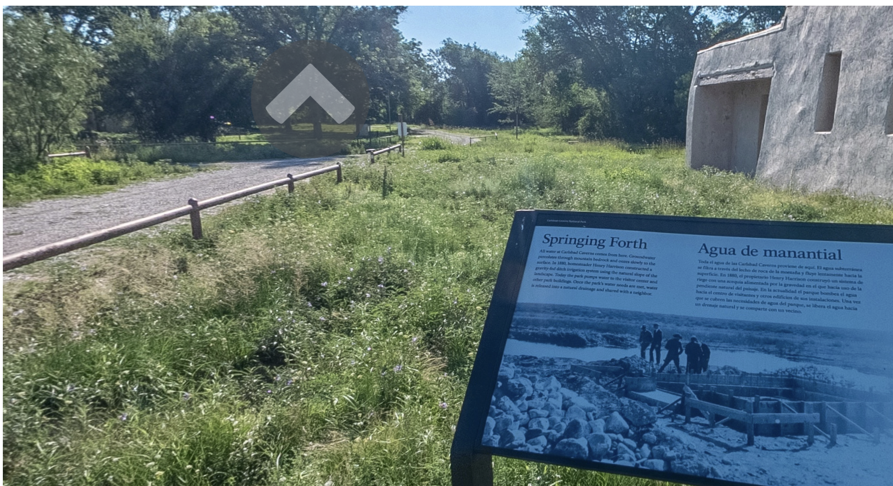
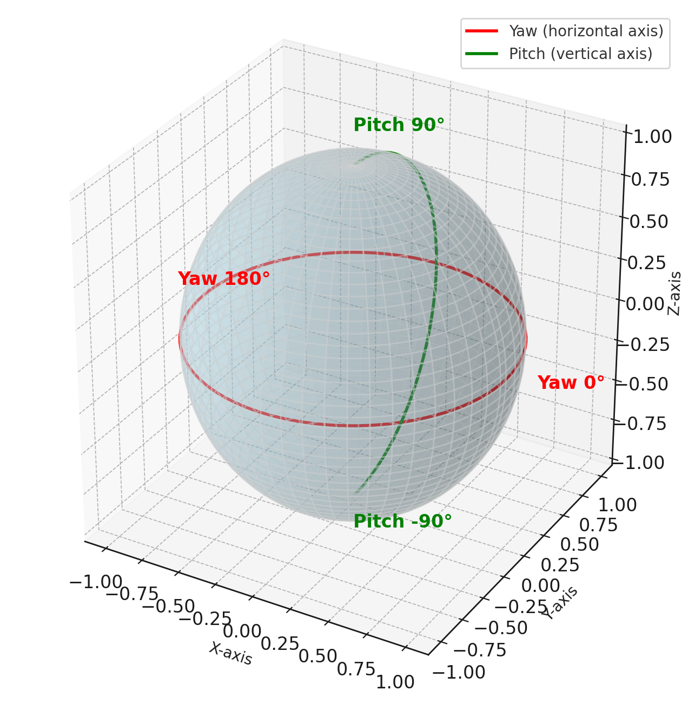
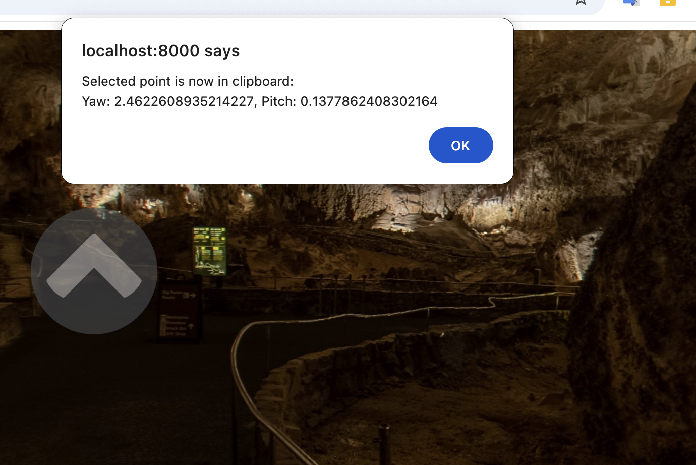
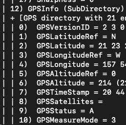

# Assessment of Marzipano Viewer for Virtual Tour Software Development



[live site](https://codetricity.github.io/carlsbad-tour/)

If you're planning to build a virtual tour, this repository isn't intended for production use. Instead, consider using the free [Marzipano Tool](https://www.marzipano.net/tool/), which, while closed-source, offers an excellent starting point for creating virtual tours.

This project, however, is valuable for anyone looking to learn more about how to build virtual tour, monitoring or analysis software using Marzipano as the 360° image viewer. In 2025, we anticipate that companies will likely group and link multiple RICOH THETA images together.  This grouping
will likely expand beyond traditional tours for entertainment or real estate sales and include activities such as monitoring an industrial process.

## Intended Use Cases

This assessment is aimed at developers considering building custom software to manage 360° images for various applications, such as:

* factory floor monitoring and optimization
* retail space optimization
* real estate sales
* virtual experiences for parks, museums, hotels
* natural disaster assessment
* public infrastructure assessment - sewer pipes, rain water drainage, power lines

## Learning Objectives

Most virtual tour software have common technology concepts.

* pitch and yaw of sphere and hotspots
* data format of tour
* performance - cubemap versus equirectangular, multi-resolution, compression
* editing

The best way to learn about these concepts is to build your
own simplified virtual tour system.

## Input Data

The project assumes images are captured with a RICOH THETA X or Z1 camera. This prototype demonstrates manual placement of hotspots. Future iterations will explore leveraging the built-in compass, gyroscope, and accelerometer metadata from these cameras. Additionally, the THETA X offers GNSS support for geolocation data.

For this study, the images lack metadata, focusing instead on:

* Hotspot events and data formats
* Pitch and yaw for images and hotspots
* Basic Marzipano concepts, such as geometry, limits, views, and scenes
* User interaction for determining pitch and yaw values to build a tour

Although Marzipano is primarily a 360° image viewer, its combination with the Marzipano Tool provides a useful reference for building custom virtual tour software.

## Data Format

There is no standardized format for representing virtual tour data, such as scenes, pitch, yaw, hotspots, and settings. While the Marzipano Tool’s data format can serve as a de facto standard, this project uses a simplified custom format to make getting started easier. For instance, each scene uses a unique ID based on the image filename.

Example data:

```json
const data = [
  {
    filename: "carlsbad_0.jpg",
    yaw: 0.009621012850468347,
    pitch: 0.5,
    hotspots: [
      {
        yaw: -0.8043556272753545,
        pitch: -0.10639414611516074,
        switchTo: 1,
        icon: "up.png",
      },
```

## Pitch and Yaw

Pitch refers to vertical movement (up and down), while yaw indicates horizontal movement (left and right). These values are expressed in radians:

* A full circle equals 2 * pi radians (360°).
* Half a circle equals 1 * pi radians (180°).



### Determining Pitch and Yaw

As an educational project, pitch and yaw values are determined manually by clicking on a scene in the viewer. This interaction calculates the pitch and yaw values.

A simple tool has been added to save these values to the clipboard, which can then be pasted into `data.json`. This tool appears after a mouse press lasting longer than 3.1 seconds.



Relevant code snippet:

```javascript
// Convert to normalized coordinates (0 to 1)
var x = relativeX / rect.width;
var y = relativeY / rect.height;
// Use  method from Marzipano View: screenToCoordinates
var result = currentView.screenToCoordinates({ x: relativeX, y: relativeY });
```

Result example:

```text
Yaw: ${result.yaw}, Pitch: ${result.pitch}`
```

For initial view, placing mouse in center of screen gives the center
of the view.

For the hotspot, the mouse is in the upper right corner.

## Images

Images are from a RICOH THETA Z1 taken by the National Park
Service and released under the [Public Domain, No Copyright](https://creativecommons.org/publicdomain/mark/1.0/).

[Photostream on Flickr](https://www.flickr.com/photos/193079646@N03/with/52283079899)

## Other Tools

* [panorama-to-cubemap](https://github.com/jaxry/panorama-to-cubemap)
* [transform360](https://github.com/facebook/transform360)

## Running Marzipano Tool Locally

Marzipano Tool is built on top of Marzipano.

Run a web server locally such as `python -m http.server`


## Inspiration

For creative ideas, check out the [Tour de Force virtual tour of Carlsbad Caverns](https://www.tourdeforce360.com/carlsbad/).

## Future Directions

### Navigation

The initial view is inconsistent depending on which arrow is pressed.  Make the initial view consistent.

### Performance Optimization

* replace equirectangular with cubemap and explain difference
* multiresolution loading
* optimize image loading

### Editing Features

* move from mouse long-press to editor mode button
* use Marzipano Tool again for ideas
  * build a subset as open source
* write data to downloadable file
* based on [this discussion](https://groups.google.com/g/marzipano/c/6EF6Q_37aMo/m/DYVM-r1PAQAJ), it's possible to run Marzipano locally

### Data Standardization

* revise data format with Marzipano Tool as a reference.

### Automating View Placement

RICOH THETA metadata has these fields:

* PoseHeadingDegrees = 236.5
* PosePitchDegrees = 0.0
* PoseRollDegrees = 0.0

Pitch and roll are disabled due to auto-leveling.


When the THETA X GPS unit is enabled, these fields
are also available.



Metadata information is [available on GitHub](https://github.com/ricohapi/theta-api-specs/blob/main/theta-metadata/README.md).

Video CaMM data extraction.

`exiftool -ee -V3 path/to/your/video.MP4 > path/to/results.txt`

#### CaMM data community discussions

* [IMU Data Libraries](https://github.com/ricohapi/theta-api-specs/blob/main/theta-metadata/README.md)
* [RICOH THETA Z1 Firmware 3.01.1 - Adds Single-Fisheye, simultaneous recording of 2 videos, 50min video length](https://community.theta360.guide/t/ricoh-theta-z1-firmware-3-01-1-adds-single-fisheye-simultaneous-recording-of-2-videos-50min-video-length/9095?u=craig)
